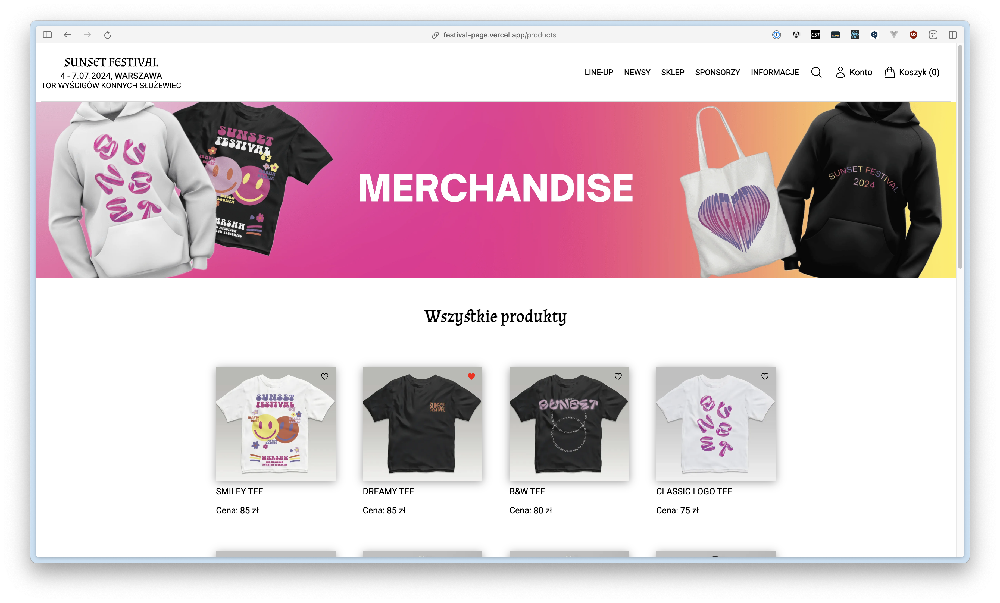
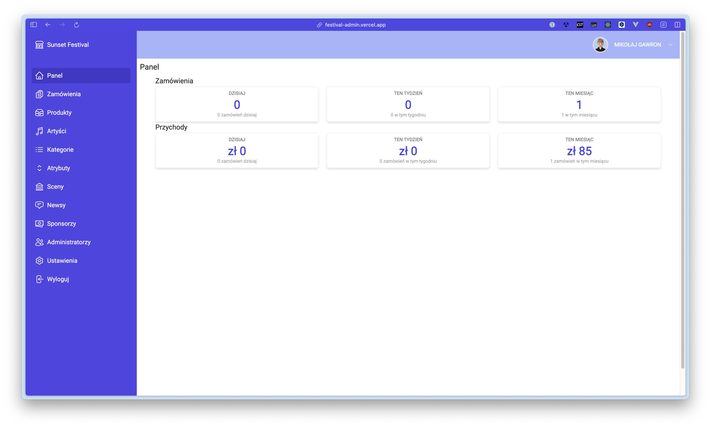
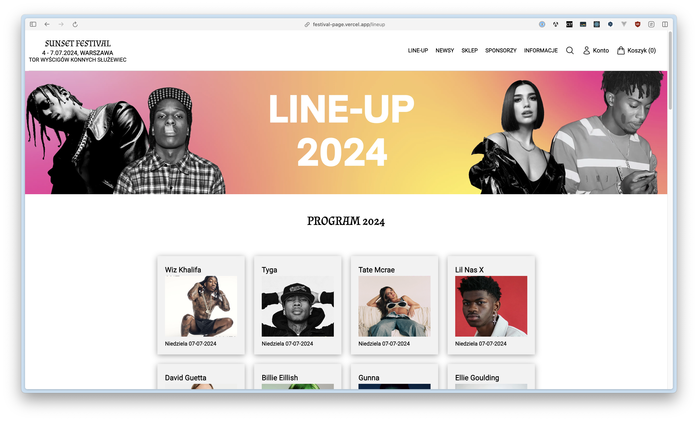
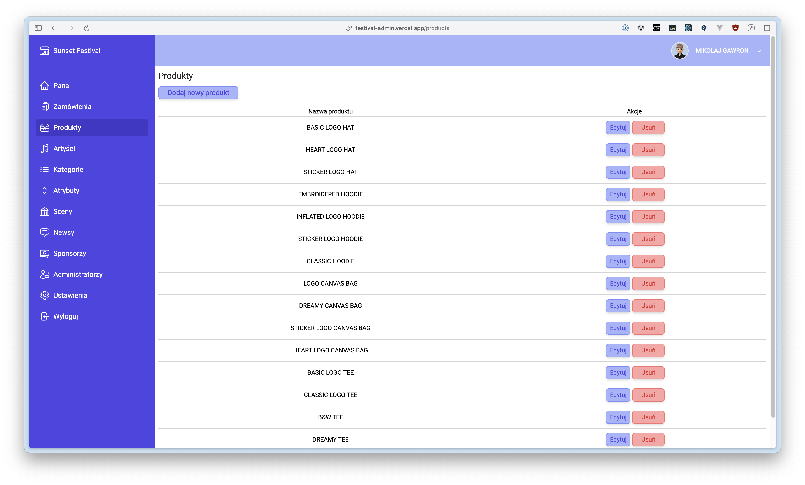
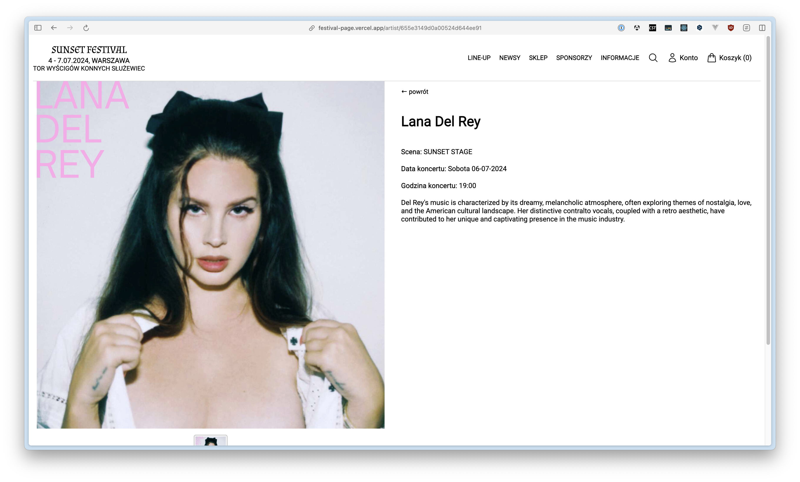
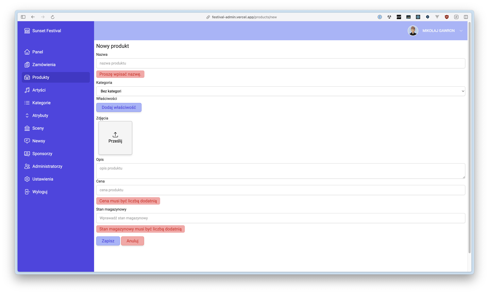

# Sunset Festival

Strona festiwalu muzycznego ze sklepem i panel administracyjny.

Link: https://festival-page.vertyll.dev

## Struktura repozytorium

| Katalog                            | Opis                                                                                       |
|------------------------------------|--------------------------------------------------------------------------------------------|
| `backend/`                         | Spring Boot 4.1, Java 25 - API                                                             |
| `frontend/packages/shared/`        | `@festival/shared`: typy modeli API, klient HTTP z CSRF, sesja, walidacja, formaty         |
| `frontend/apps/page/`              | Strona festiwalu i sklep                                                                   |
| `frontend/apps/admin/`             | Panel administracyjny                                                                      |
| `frontend/Dockerfile`              | Wieloetapowy obraz dla obu front-endów (`--build-arg APP=page\|admin`)                     |
| `docker-compose.dev.yml`, `infra/` | Lokalnie: MongoDB + Garage + mock logowania Google, opcjonalnie cały system (profil `app`) |
| `.github/workflows/`               | CI/CD                                                                                      |

## Back-end

### Stos technologiczny

- Spring Boot.
- Java.
- Maven.
- MongoDB.
- JUnit.
- Mockito.
- Lombok.
- Spring Security.
- Spring Data MongoDB.
- Spring Web.

### Budowanie i jakość

```bash
cd backend
./mvnw spotless:apply   # formatowanie
./mvnw verify           # kompilacja z Error Prone/NullAway, testy, Spotless, PMD, SpotBugs
```

> [!IMPORTANT]
>
> Polecenie `verify` wymaga środowiska skonteneryzowanego dla Testcontainers.

### Moduły

| Pakiet                                 | Odpowiedzialność                                               |
|----------------------------------------|----------------------------------------------------------------|
| `security`                             | Spring Security, logowanie Google (OIDC), CSRF, `/api/me`      |
| `administrator`                        | Lista administratorów panelu                                   |
| `catalog.{product,category,attribute}` | Produkty z opcjami i wariantami, kategorie, atrybuty           |
| `lineup.{artist,stage}`                | Artyści i sceny                                                |
| `content.{news,sponsor}`               | Newsy i sponsorzy                                              |
| `settings`                             | Ustawienia sklepu                                              |
| `shop.{address,wishlist,order}`        | Adres dostawy, lista życzeń, zamówienia                        |
| `media`                                | Upload zdjęć do Garage                                         |
| `i18n`                                 | Tłumaczenia interfejsu w MongoDB (ICU), edycja w panelu        |
| `common`, `config`                     | Błędy (RFC 9457), walidacja, konfiguracja Mongo/Jackson/zegara |

### Profile i konfiguracja

Profil jest obowiązkowy (`SPRING_PROFILES_ACTIVE=local` albo `prod`).

| Plik                           | Zawartość                                                            |
|--------------------------------|----------------------------------------------------------------------|
| `application.properties`       | wspólna konfiguracja, bez zmiennych środowiskowych                   |
| `application-local.properties` | pełna konfiguracja lokalna (usługi z `docker-compose.dev.yml`)       |
| `application-prod.properties`  | same odwołania `${...}` do zmiennych środowiskowych (tabela poniżej) |

W profilu `local` logowanie Google zastępuje [mock-oauth2-server](https://github.com/navikt/mock-oauth2-server). 
Na ekranie logowania wpisuje się dowolną nazwę użytkownika, np. `admin`, a mock wystawia token z adresem `<nazwa>@festival.local`.
Użytkownik `admin@festival.local` jest administratorem panelu (`festival.security.bootstrap-admins`).

Na produkcji klienci Google OAuth muszą mieć dozwolone adresy przekierowania:
- `${FESTIVAL_PAGE_URL}/login/oauth2/code/page`
- `${FESTIVAL_ADMIN_URL}/login/oauth2/code/admin`

Zmienne środowiskowe profilu `prod`:

| Zmienna                                                | Opis                                                         |
|--------------------------------------------------------|--------------------------------------------------------------|
| `MONGODB_URI`                                          | np. `mongodb://localhost:27017/festival`                     |
| `FESTIVAL_PAGE_URL`, `FESTIVAL_ADMIN_URL`              | publiczne adresy front-endów (redirect URI logowania)        |
| `GOOGLE_PAGE_CLIENT_ID`, `GOOGLE_PAGE_CLIENT_SECRET`   | klient OAuth strony festiwalu                                |
| `GOOGLE_ADMIN_CLIENT_ID`, `GOOGLE_ADMIN_CLIENT_SECRET` | klient OAuth panelu                                          |
| `FESTIVAL_BOOTSTRAP_ADMINS`                            | e-maile administratorów dopisywane przy starcie              |
| `FESTIVAL_CHECKOUT_ENABLED`                            | czy można składać zamówienia (`true`/`false`)                |
| `S3_ENDPOINT`, `S3_REGION`, `S3_BUCKET`                | Garage: API S3, region (`s3_region` z `garage.toml`), bucket |
| `S3_ACCESS_KEY`, `S3_SECRET_ACCESS_KEY`                | klucz Garage z uprawnieniem zapisu do bucketa                |
| `S3_PUBLIC_BASE_URL`                                   | publiczny adres bucketa (web endpoint Garage)                |
| `INTERNAL_CA_CERT`                                     | CA klastra (TLS do MongoDB i Garage): `file:/tls/ca.crt`     |

## Front-endy

### Stos technologiczny

- Next.js.
- React.
- Node.js.
- Tailwind CSS.
- styled-components.

### Budowanie i jakość

```bash
cd frontend
npm ci
npm run dev:page        # http://localhost:3000
npm run dev:admin       # http://127.0.0.1:3001
npm run lint && npm run typecheck && npm run format:check && npm run check:translations
```

> [!NOTE]
>
> Adres back-endu dla `next dev` znajduje się w `apps/*/.env.development` (`BACKEND_INTERNAL_URL=http://localhost:8080`).

## Uruchomienie lokalne

> [!IMPORTANT]
>
> **Wymagania**: Docker, Java 25, Node.js 24.

```bash
docker compose -f docker-compose.dev.yml up -d   # MongoDB :27017, Garage :3900 (S3) i :3902 (publiczny odczyt), mock Google :8090

cd backend && SPRING_PROFILES_ACTIVE=local ./mvnw spring-boot:run   # :8080
cd frontend && npm ci && npm run dev:page                           # http://localhost:3000
cd frontend && npm run dev:admin                                    # http://127.0.0.1:3001
```

Albo cały system w kontenerach: `docker compose -f docker-compose.dev.yml --profile app up -d --build`.

## Zrzuty ekranu

| Strona                                   | Panel                                     |
|------------------------------------------|-------------------------------------------|
|          |          |
|          |          |
|          |          |
