

    
    
    
    
    
    
    
    
    

## Project Assumptions

Music festival website with a shop, and an admin panel to run both.

## Link: https://festival-page.vertyll.dev

## Technology Stack

### Back-end:

- Spring Boot.
- Java.
- Maven.
- MongoDB.
- Redis (Spring Session).
- Garage (S3-compatible storage for images).
- JUnit.
- Mockito.
- Testcontainers.
- Lombok.
- Spring Security.
- Spring Data MongoDB.
- Spring Web.
- Spring Mail.

### Front-end:

- Next.js.
- React.
- TypeScript.
- Tailwind CSS.
- styled-components.
- pnpm workspaces with Turborepo: the festival page (`apps/page`), the admin panel (`apps/admin`) and shared code
  (`packages/shared`).

### Authentication:

- **Identity provider**: Keycloak (realm `festival`); the application never sees a password.
- **Pattern**: BFF with Spring Security's OAuth2 client; the browser holds only a session cookie.
- **Session store**: Redis (Spring Session).
- **JWT**: verified on every request; a client without a browser calls the API with a Bearer token.
- **Details**: [Authentication](./docs/authentication.md).

### Core back-end:

- Maven build system.
- The application has an exception handling mechanism (RFC 9457 problem details).
- The application has a logging mechanism.
- The application has separate environments for local and prod.
- The application has a dedicated configuration file.
- The application has RBAC (Role Based Access Control).
- The application has translations stored in MongoDB (ICU MessageFormat), editable in the admin panel.
- The application has image uploads to S3-compatible storage.
- And many other features that can be found in the application code.

### Core front-end:

- Monorepo with shared types, HTTP client with CSRF, session handling and validation.
- The application has separate environments for local and prod.
- Polish and English, with translations served by the back-end.
- And many other features that can be found in the application code.

### Other:

- Docker for development environment.
- PMD for static code analysis.
- SpotBugs for static code analysis.
- JSpecify for null-safety annotations.
- NullAway for null-safety checks.
- Error Prone for static code analysis.
- Spotless for code formatting.
- ESLint and Prettier for the front-end.

## Preview Screenshots

### Festival page

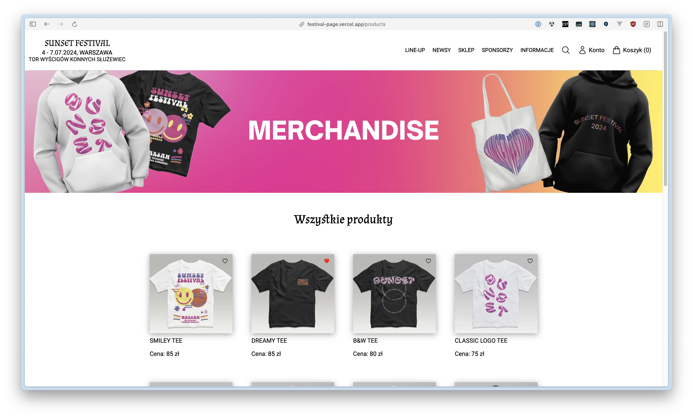
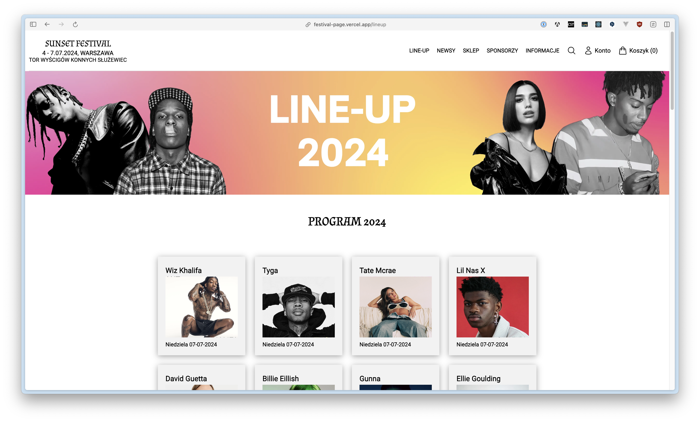
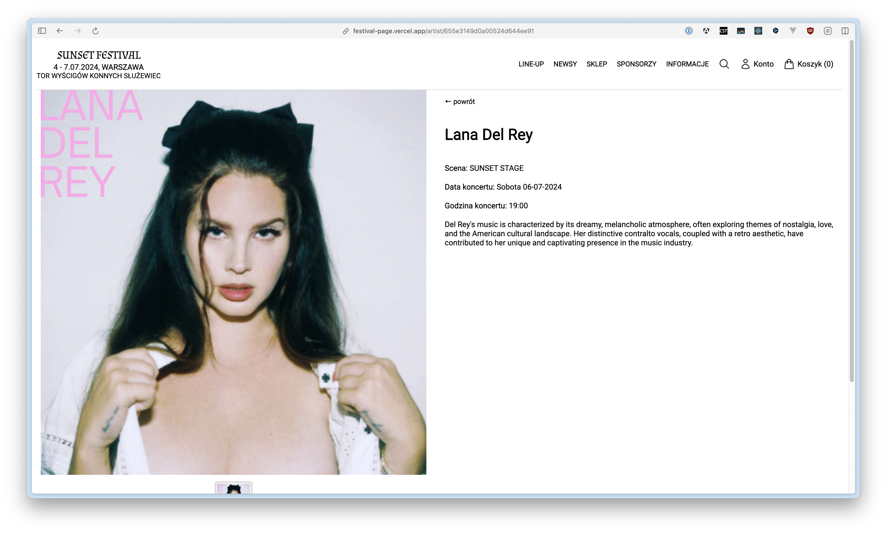
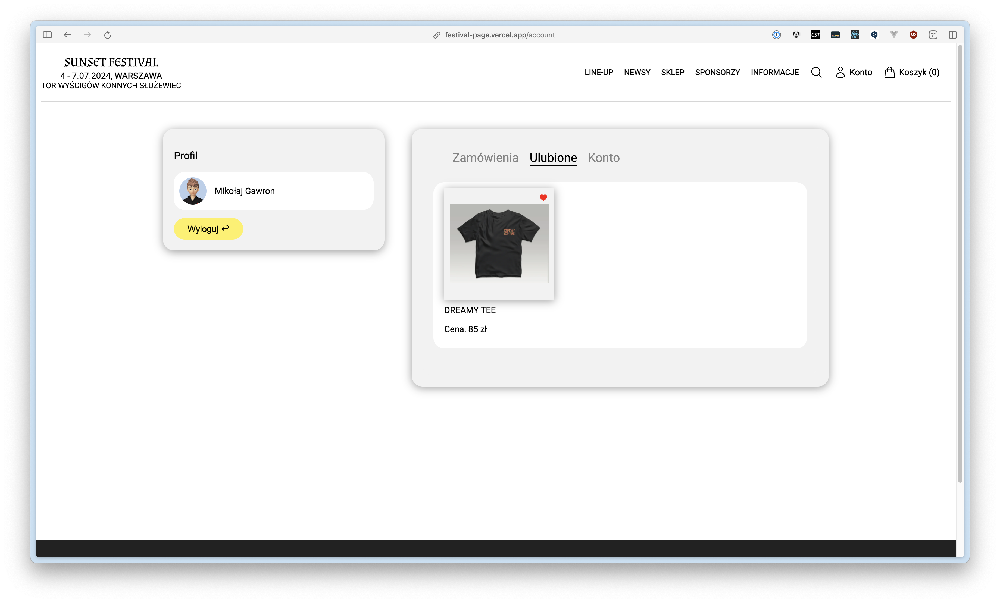
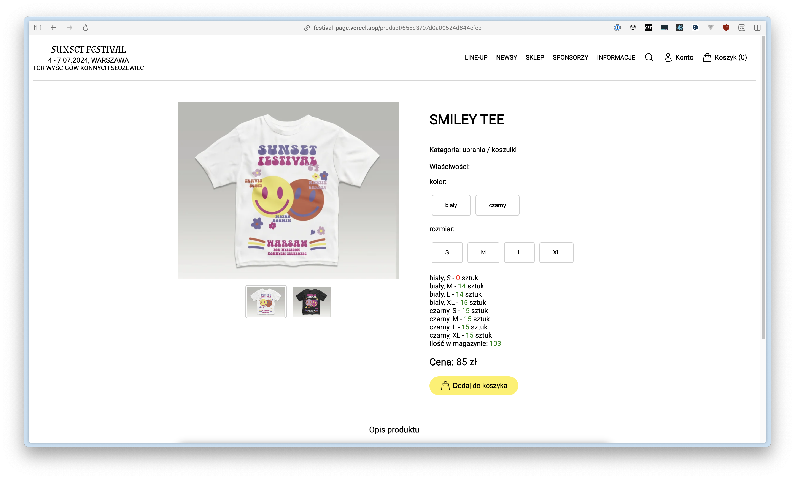
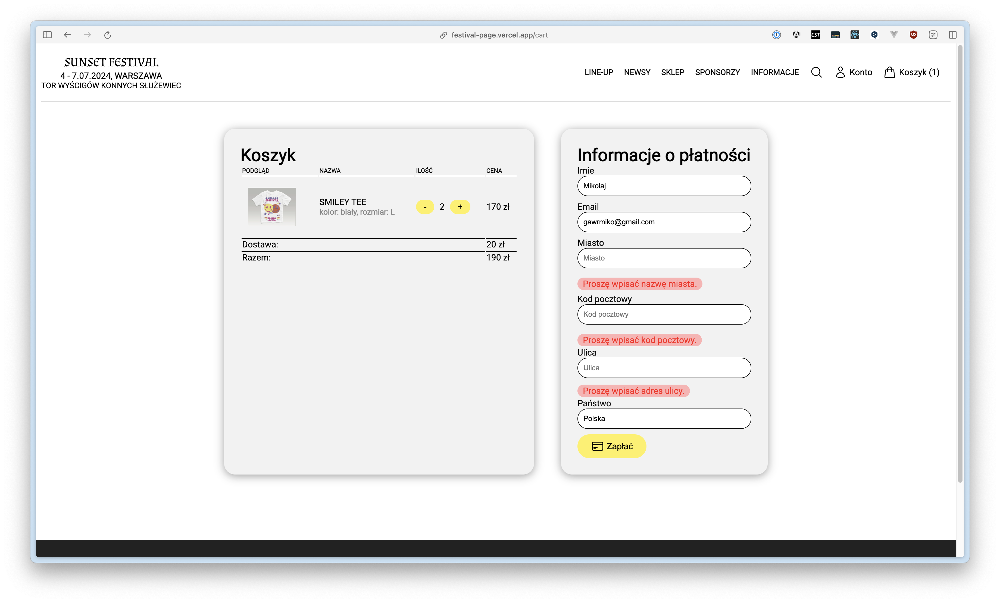

### Admin panel

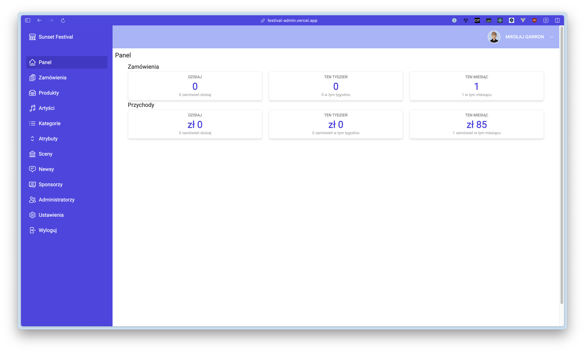
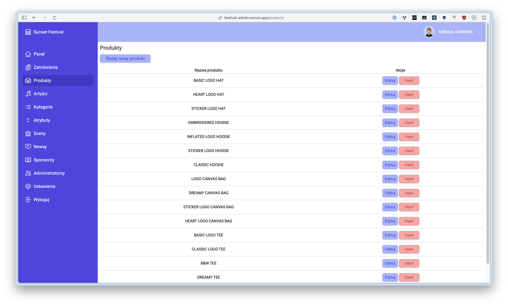
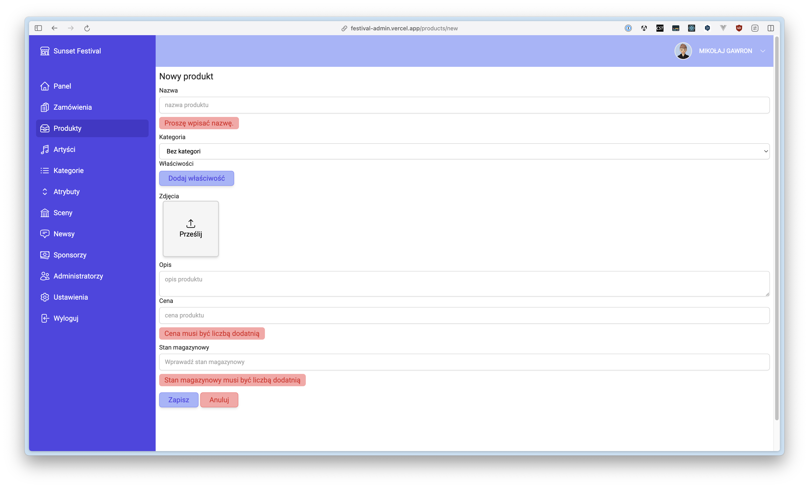
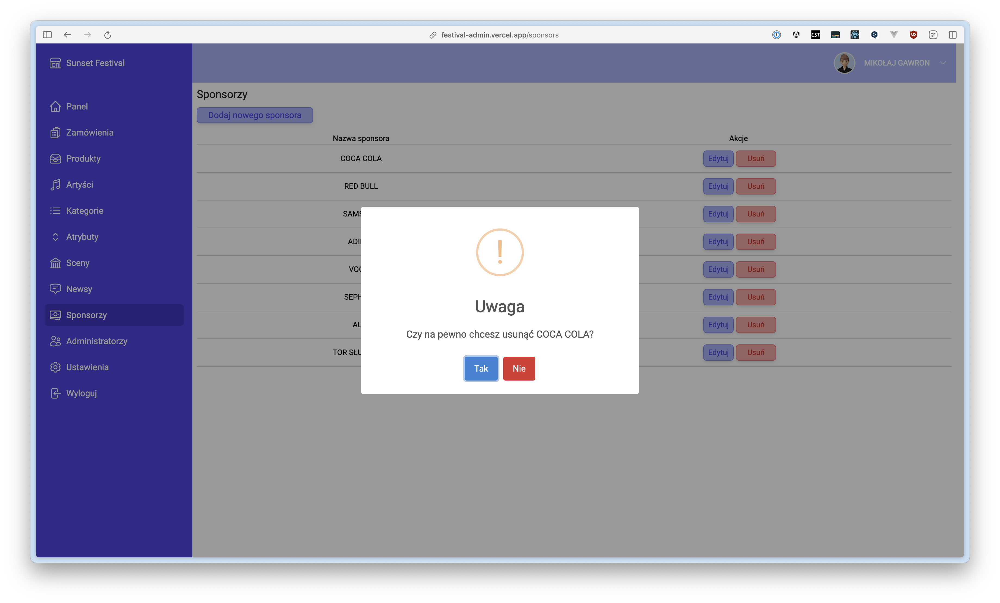
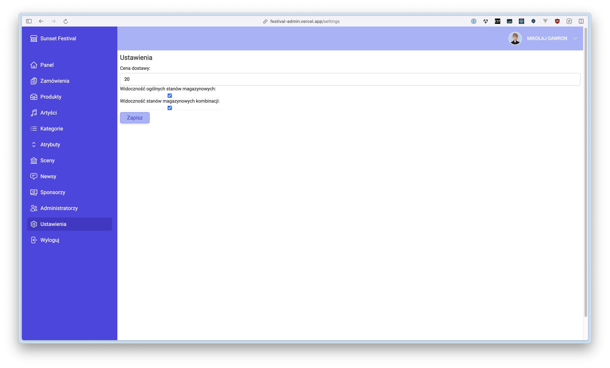
