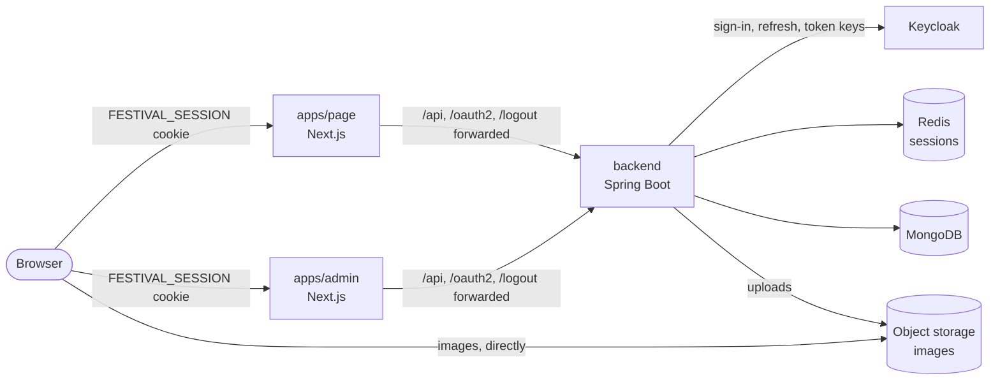

# Architecture

## Three applications, one back-end

| Application                                                | What it is                                                      |
|------------------------------------------------------------|-----------------------------------------------------------------|
| `frontend/apps/page` ([front-end](../frontend/README.md))  | the festival page and shop (Next.js)                            |
| `frontend/apps/admin` ([front-end](../frontend/README.md)) | the admin panel (Next.js)                                       |
| `backend` ([back-end](../backend/README.md))               | a Spring Boot API over MongoDB, Redis and S3-compatible storage |

The browser talks only to its Next.js application. Each application forwards `/api/*`, `/oauth2/*`,
`/login/oauth2/*` and `/logout` to the back-end (`frontend/next.config.base.mjs`), so the back-end's cookies are set on
the application's own address and every API call is same-origin.

## Errors and translations

The back-end answers every refusal with a message key, and the front-end renders it from the back-end's catalog: [Error
responses](mechanisms/error-responses.md).
