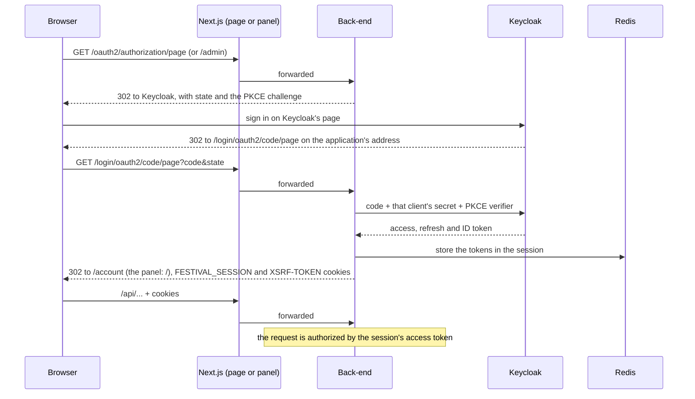

# Authentication

The application never handles a credential. Keycloak (realm `festival`) owns every page that touches one: sign-up,
sign-in, email verification, password reset, two-factor authentication and acceptance of the terms of use. The
back-end is a BFF: it signs the user in, keeps the tokens in its session and gives the browser only a session cookie.

## Two clients

The festival page and the admin panel sign in with separate Keycloak clients, each with its own secret and redirect
address:

| Client           | Application | Lands on, after sign-in | Who may sign in                        |
|------------------|-------------|-------------------------|----------------------------------------|
| `festival-page`  | the page    | `/account`              | any account with a verified email      |
| `festival-admin` | the panel   | `/`                     | an account with the `ADMIN` realm role |

`FestivalOidcUserService` refuses an account without a verified email, and refuses the admin client to anyone without
`ADMIN`. A refused or failed sign-in lands on the application's failure path (`?loginError=true`).

## Signing in

1. The application sends the browser to `/oauth2/authorization/page` or `/oauth2/authorization/admin`, which Next.js
   forwards to the back-end. `LocalizedAuthorizationRequestResolver` builds the authorization request with PKCE and
   passes the language from the `NEXT_LOCALE` cookie.
2. Keycloak returns to `/login/oauth2/code/{client}` on the application's own address. Spring Security exchanges the
   code with that client's secret and keeps the tokens in the HTTP session.
3. `LoginRedirectHandler` sends the browser to the client's landing path.

The browser holds only the `FESTIVAL_SESSION` cookie (`HttpOnly`, `SameSite=Lax`, `Secure` in production) and the
`XSRF-TOKEN` cookie. `GET /api/me` tells the application who is signed in, whether they are an administrator, and the
address of their Keycloak account page.

## Every API request is authorized by a token

For a request to `/api/*` with a session, `SessionAccessTokenFilter` takes the access token from the session,
refreshing it when it is about to expire, and authorizes the request with that token rather than with the session. The
token is verified like any resource server's: the signature against Keycloak's published keys, the issuer, the expiry
and the audience (`festival-api`). `ADMIN` in the token's realm roles becomes `ROLE_ADMIN`, so revoking it in Keycloak
cuts admin access within minutes.

A client without a browser calls the same API with `Authorization: Bearer` and its own Keycloak token; the same checks
apply.

## Sessions and refreshing

The session lives in Redis for ten hours, and its access token is refreshed once per refresh token, across instances:
[Token refresh](../backend/docs/mechanisms/token-refresh.md).

## Signing out

The application posts to `/logout`. The back-end ends its session and answers with Keycloak's end-session address for
the client the user signed in with, carrying the ID token; the browser follows it, Keycloak ends its session and returns
to the application's home page.

## CSRF

Every unsafe request repeats the `XSRF-TOKEN` cookie in a header: [CSRF](mechanisms/csrf.md).

## Code

All in `backend/src/main/java/com/vertyll/festival/security` unless noted:

| Class                                                 | Role                                              |
|-------------------------------------------------------|---------------------------------------------------|
| `SecurityConfig`                                      | the filter chain, both client registrations, CSRF |
| `FestivalOidcUserService`                             | verified email, the admin client's role check     |
| `LocalizedAuthorizationRequestResolver`               | PKCE and the language                             |
| `LoginRedirectHandler`                                | landing and failure paths per client              |
| `SessionAccessTokenFilter`, `SessionAccessTokens`     | a session's request authorized by its token       |
| `SingleFlightRefreshTokenProvider`, `SharedRefreshes` | one refresh per refresh token                     |
| `LogoutUrlResponder`                                  | Keycloak's end-session address                    |
| `frontend/packages/shared/src/auth/session.tsx`       | signing in and out from the applications          |
